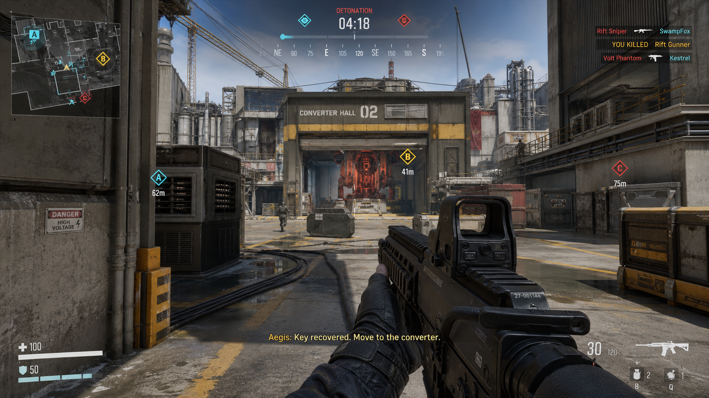

# Fusepoint Product Requirements Document

## 1. Product Positioning

**Fusepoint** is a single-player, first-person story mission set in daylight and built with native Godot 4.7. The player is a lone assault/EOD operator from the Aegis special operations unit entering Kestrel Ridge Military Base, which has been infiltrated by the Rift Front. The enemy has installed a large timed explosive device in the Sector C rocket maintenance bay. The player must leave the spawn point, retake Point A and then Point B in order, obtain the defusal keys, reach Point C, and dismantle the device before the authoritative countdown reaches zero.

This is not a multiplayer game. It has no teammates, allied AI, squad commands, or team score. Pressure comes from enemy distribution, route choice, time management, cover, and readable enemy behavior.

The mission is not an abstract three-point competition. Points A and B must be retaken in order: each capture commits one defusal key, opens the next route, advances a radio story beat, and pushes the enemy defense deeper into the base. Point C is the only bomb location and is not captured. On success, combat freezes and the camera pulls back along a safe path to show the player character's victory dance and mission results. On failure, the authoritative countdown reaching zero triggers a layered explosion instead of merely showing a generic Game Over screen.

The product aims to approach a complete premium story-driven FPS experience: correctly scaled industrial environments, clear routes and cover, responsive weapons, moving and animated enemies, a state-truthful HUD, short radio exchanges with character, an impactful explosive climax, complete menu and result flows, and stability that can be accepted through runtime evidence. It must not degrade into a static scene, debug sandbox, pre-rendered cutscene, or a menu that drops the player directly into the map.

This PRD defines the product target and player-observable quality contract. Tool protocols, asset indexes, evidence orchestration, telemetry formats, and low-level Godot conventions are defined by GameLoop implementation policy.

## 2. Player Promise

At any moment, the player should be able to answer four questions:

1. How much time remains before detonation?
2. Which control point or defusal step matters most now?
3. Which route will get me there more safely or more quickly?
4. What exactly changed because of my last action?

The presentation should be restrained, tense, and clear. Large structures, landmarks, routes, and cover establish spatial judgment first; materials, animation, audio, lighting, and effects then explain state changes. Effects must not hide scale errors, an empty map, or gameplay without causality.

## 3. Core Mission Loop

One mission is a five-minute high-pressure defusal route containing a briefing, ordered A/B progression, the Point C defusal, and results:

1. Complete the briefing and loadout confirmation at the daylight base perimeter, then deploy from the Aegis spawn. The bomb countdown starts immediately after deployment is confirmed.
2. During the first 10 seconds after deployment, show non-blocking opening story text. The text appears character by character with a typewriter effect, completes, and then fades over several seconds. The countdown, reticle, and movement controls remain available throughout.
3. Advance along the main route from spawn to Point A, hold the Point A capture radius alone, and clear the enemy. An enemy entering the radius contests, freezes, or reverses progress.
4. Completing Point A commits the first defusal key, plays a 10–20 second radio story beat, and opens the route to Point B. Point B cannot be completed before this.
5. Advance from Point A to Point B along the main or flank route, complete the second capture under the same rules, commit the second key, and open the route to Point C.
6. After reaching the Point C rocket maintenance bay, perform three defusal stages in order: diagnose the device, isolate power, and remove the detonator. Point C shows bomb state and an interaction radius, not capture progress.
7. If the final stage completes before the countdown reaches zero, authoritative state becomes `bomb_defused`: freeze combat, switch the bomb to a safe state, pull the camera back into third person, show the character facing the player-facing camera and performing a victory dance, then display completion time, remaining time, score, A/B captures, eliminations, deaths, and leaderboard rank.
8. If the countdown reaches zero first, authoritative state becomes `bomb_detonated`: first commit one lethal explosion-damage event, set player health to zero, and disable input, attack, and collision; then play the flash, fireball, sparks, debris, pressure wave, dust, lighting response, low-frequency audio, and rumble. The camera takes a strong initial impulse and shake before falling downward, while a red damage effect expands from the edges and decays. Only after the death presentation completes may the game enter the failure video, failure result, and restart/replay actions.

Every player action must produce a traceable causal result in applicable gameplay state, animation, audio, VFX, HUD, and camera feedback. A static screenshot, an independently decreasing number, an independently playing particle effect, or a debug label cannot prove completion.

## 4. Control Point, Countdown, and Bomb Rules

### 4.1 Authoritative Mission State

- Aegis uses cyan-white player/objective identification; the Rift Front uses amber-red threat language.
- Point A (Alpha) and Point B (Bravo) begin under Rift Front control and must be retaken in A → B order. Point C (Charlie) is not a capture point; it is the locked bomb location.
- The default bomb countdown is five minutes after deployment and is configured by a data resource. It advances only during `active_gameplay`. True pause, ordinary-death lock, checkpoint selection/restore, `bomb_detonated`, `bomb_defused`, death/victory videos, and result screens do not advance time. The countdown can end only in `bomb_defused` or `bomb_detonated`; death presentation and restart actions cannot consume additional time.
- Points A and B each commit one unique defusal key. Both keys must be committed before the route to Point C can open and final defusal can begin. There is no third capture key.
- Retaken Points A and B become friendly positions and checkpoints. A checkpoint saves the countdown, routes, keys, enemies, and mission state at commit time. Restarting cannot create additional time.
- Success requires both A/B keys to be committed and the final detonator-removal stage to complete while the countdown is greater than zero. Reaching the bomb is not success.
- Failure occurs immediately if the countdown reaches zero before the final stage completes. HUD, input, score, AI, animation, and effects cannot override, delay, or fabricate this result.
- The countdown and defusal submission use the same mission tick and terminal controller. Each tick commits the countdown first and then checks the final defusal-stage submission. If the countdown reaches `0` first, `bomb_detonated` has priority. The game may enter `bomb_defused` only when `remaining_time > 0` at submission. Terminal submission must be atomic and occur exactly once.
- The default score formula is `10 × floor(remaining seconds) + 500 × A captured + 500 × B captured + 100 × eliminations + 250 × diagnosis complete + 250 × isolation complete + 1000 × detonator removal complete - 500 × deaths - 250 × checkpoint restarts`. Failed runs show earned score but cannot enter the fastest-success leaderboard. The result page must show every component. Successful runs tied on score are ordered by completion time, deaths, and restarts, in that order.
- The local leaderboard records at least fastest successful completion time, remaining time, score, A/B capture state, eliminations, deaths, restart count, timestamp, and selected loadout. Failed runs may enter recent history but cannot overwrite the fastest successful completion record.

### 4.2 Control Point State Machine

Each capture point, limited to A and B, has a stable ID, owner, progress, occupants, defusal key, checkpoint state, and event history:

- `held_rift`: enemy-controlled; the defensive encounter is active.
- `capturing_aegis`: the player is inside the radius with no effective enemy occupant; progress advances.
- `contested`: the player and enemy are both inside the radius; progress freezes and the HUD clearly displays “CONTESTED.”
- `recapturing_rift`: the enemy regains local superiority; progress already earned by the player gradually recedes.
- `secured_aegis`: the point is complete, its key is committed, and its checkpoint is available.

The default capture radius is 8 meters, and an uncontested solo capture takes 12 seconds. The progress curve must be driven by the authoritative controller and observable in runtime evidence. A point cannot change owner silently in a single frame.

### 4.3 Bomb State Machine

Bomb states are `armed`, `accessible`, `diagnosing`, `isolating_power`, `removing_detonator`, `defused`, and `detonated`. The three interaction stages take 18 seconds in total by default.

- The interaction prompt shows only the currently legal stage and cannot expose an action that is not yet unlocked.
- Taking damage, leaving the safe radius, an enemy entering the interaction radius, or entering a terminal state interrupts the current stage.
- Interruption must have visual, audio, and HUD feedback. Completed stages remain latched and cannot fabricate completion or regress.
- The countdown does not stop because the player approaches the bomb, begins interaction, or plays an animation. Only `bomb_defused` or a true pause can stop it.

### 4.4 A/B Capture Points and Point C Identity

- **Point A (Alpha / Foundry Gate):** a heavy entrance at the base perimeter with a service route and elevated overlook. Capturing Point A obtains the bomb-wiring topology, opens the western gate, and establishes the first checkpoint.
- **Point B (Bravo / Crane Yard):** a mid-base crane transfer yard with stacked cover, a maintenance room, and two exposed crossings. Capturing Point B obtains the isolation frequency, opens the maintenance shortcut to Point C, and establishes the second checkpoint.
- **Point C (Charlie / Rocket Maintenance Bay):** a rocket maintenance bay deep inside the base, containing fuel lines, power equipment, low cover, and a prominent bomb mount. Point C has no capture ring, only a bomb interaction radius. It must provide two breach options, defensible cover, readable defusal components, and camera paths for both the successful pullback and the failed explosion.

Points A and B each require at least one landmark, a clear capture boundary, two entry routes, one fallback route, three meaningful cover choices, and a distinct material/color family. Point C requires at least one bomb landmark, a clear interaction radius, two breach routes, one fallback route, three cover choices suitable for defending the defusal, and a distinct rocket-maintenance material family.

### 4.5 Opening Story and Mission Prompts

The opening briefing does not play a long cutscene or remove player control. Immediately after deployment confirmation, enter `opening_story_overlay`: the countdown has already begun, the player can move, look, and ready a weapon, and the story text occupies only the upper safe area without covering the reticle, countdown, spawn route, or enemies.

The baseline opening copy is below. It may be polished later but cannot change mission causality:

```text
11:40 — Kestrel Ridge Military Base
The Rift Front has planted a timed bomb in the Sector C rocket maintenance bay.
Communications are down. Support is not coming. You are the only operator who can enter the base.
Retake A first, then hold B and recover the defusal keys.
In five minutes, the base will disappear with the bomb.
```

Presentation timing must be observable: type each line from 0–6 seconds at a fixed character rate; hold the complete text from 6–10 seconds; fade the whole layer to zero opacity from 10–13 seconds. If the player dies, pauses, or enters a terminal state, the state machine interrupts the current text and starts it again on restart/replay. Skipping the story skips presentation only; it cannot skip deployment, the countdown, or the Point A objective. Story subtitles and radio dialogue share speaker, subtitle size, backing-opacity, and volume settings.

Story beats must bind to mission state, and each beat advances only once:

| Trigger state | What the player hears/sees | Gameplay effect |
|---|---|---|
| `deployment_started` | Command confirms the communications outage, explains that the player is the only EOD operator able to enter the base, and states the A → B → C order | Starts only the countdown and current objective; does not lock movement or firing |
| `a_secured` | Point A restores the perimeter gate, Command uploads the first wiring topology, and the enemy is withdrawing toward B | Commits the first key, opens the route to B, and establishes a checkpoint |
| `b_secured` | Point B obtains the isolation frequency, confirms the bomb is in the Point C rocket maintenance bay, and the enemy begins its final defense | Commits the second key, opens the route to C, and changes the objective to the bomb |
| `c_bomb_interaction` | The EOD operator confirms that the device is connected to the rocket fuel/power control chain and reports diagnosis, isolation, and detonator-removal progress | Allows only the currently legal defusal stage; damage, leaving, or enemy interference interrupts it |
| `bomb_defused` / `bomb_detonated` | Enters the all-clear result narrative or the post-explosion base-failure narrative, respectively | Triggered exactly once by authoritative terminal state; dialogue cannot announce the result early |

Each radio segment lasts 10–20 seconds by default. Presentation may be skipped, but state submission cannot. Critical A/B/C objective text must update on the same frame as the HUD current objective, route opening, and key pip. If dialogue playback fails, text must still appear and the mission must advance; missing audio cannot deadlock the mission.

Story mode uses a three-act structure, and all story information must serve the current route and countdown. Act One, during deployment and Point A, explains the communications outage, that the player is the only EOD operator able to enter the base, and that the enemy controls the perimeter. Act Two, at Point B, reveals that the bomb is connected to the rocket fuel/power control chain and explains why both keys are required instead of allowing a direct rush to C. Act Three, at Point C, binds the three defusal stages to the base alarm, fuel pressure, and final countdown. The success result states that the rocket bay was preserved and records completion time; the bomb-detonation failure result states that the base and rocket maintenance bay were destroyed. Repeated “go to the next point” dialogue cannot substitute for story progression.

## 5. World and Map Contract

The final map is one coherent daylight military base, not a showroom, extracted fragments, or a collection of procedural surfaces. One spawn area, Point A, Point B, the Point C bomb bay, main routes between adjacent objectives, flank/fallback routes, readable elevation changes, collision, navigation, and objective anchors must share a realistic scale.

### 5.1 A/B/C Spatial Layout Contract

A, B, and C are not three markers that can be placed arbitrarily. They are the spatial skeleton of mission pressure and story progression:

- **Point A** must sit at the base perimeter, in a location readable from spawn without exposing the capture center directly. It provides the first contact and the perimeter retake.
- **Point B** must sit at a mid-base transport/communications node. It cannot share one combat room with A, and the capture center cannot be directly sniped from the Point A spawn position.
- **Point C** must sit inside the deep-base rocket maintenance bay with stronger containment and final-defense space. The bomb mount cannot overlap Point B and cannot appear in the first sightline from spawn or Point A.
- The three points cannot be collinear, overlap, or cluster in one small area. The A/B capture boundaries and C bomb interaction radius must be physically separate and cannot penetrate one another on the navigation mesh.
- Based on normal player sprinting, observation, combat, and cover decisions, the default effective route times are 30–45 seconds from spawn → A, 35–55 seconds from A → B, and 40–60 seconds from B → C. Actual distance depends on map scale and terrain, but the route must preserve an explicit time budget for combat and defusal.
- Each segment must provide one main route, one recognizable flank route, and one fallback/regroup route. A flank cannot be a duplicate corridor shifted only a few meters beside the main route. A fallback cannot send the player outside the playable map or through an objective volume.
- At least one elevation or sightline relationship must change between A, B, and C. Landmarks, color, lighting, and directional radio cues must let the player judge which objective they are approaching without opening the minimap.
- Objective anchors, capture volumes, bomb interaction volume, spawn safe area, cover, and navigation must sit on actual walkable surfaces. Asset convenience cannot justify floating objectives, wall-attached objectives, uncovered open-ground objectives, or an objective placed at the end of one straight line.

Acceptance must inspect an overhead route map, scene navigation/collision probes, and first-person screenshots from spawn, A, B, and C together. A coordinate table or minimap icons alone cannot prove a valid spatial layout.

### 5.2 Progressive World Targets

The delivery starts with an intentionally rough, run-owned prototype and progressively replaces it with the authored environment and bound components. The first increments must not import the complete map or production asset families early. Once the authored environment is introduced, later phases must preserve it and cannot use broad planes, cloned facades, floating floors, or extracted child meshes to manufacture a fake map.

| Phase | World target | Player-observable product target |
|---|---|---|
| `prototype_bootstrap` | Create only a bounded placeholder room, camera and ordinary input | A launchable rough prototype; no authored map, production weapon/hands, HUD, minimap, enemy AI or decorative asset collection |
| `locomotion_blockout` | Add human-scale placeholder movement, collision, a simple route and a placeholder Alpha volume | Ground contact, camera motion, restart and one authoritative placeholder objective transition; production assets remain out of scope |
| `arena_foundation` | Replace the placeholder with one complete authored environment and prove scale, ground contact, route and spawn anchor | A real daylight military-base map with intact geometry/materials, collision, safe spawn and spawn → A traversal; no production weapon, HUD, minimap or enemy AI yet |
| `weapon_foundation` | Preserve the accepted map while integrating the bound first-person weapon/hand components | AK-74M and Saiga-12 switching, ADS, semi-auto/full-auto fire, reload, hit/block feedback and basic audio; no enemy AI, final HUD or minimap yet |
| `domination_expansion` | Preserve map, movement and weapons while connecting Point B, the Point C bomb bay and fallback routes in order | Ordered A → B capture, two-key/checkpoint progression, five-minute countdown, three-stage defusal, opening story, first live minimap, health/ammo/objective/compass HUD, basic audio and state VFX; still no enemy AI |
| `combat_readability` | Preserve all accepted routes and complete cover, sightlines, navigation, encounters, and terminal camera paths | A/B/C regional enemy rosters with autonomous collision-avoiding movement, complete AI actions, combat feedback for damage/eliminations/footsteps, capture/defusal during combat, success pullback and victory dance, opening/death/victory video backgrounds, layered explosion, results/replay/menus, audio, accessibility, and performance acceptance |

The final phase may use internal premium-combat and finale-presentation gates, but these are not additional product phases. The release-quality gate spans all six phases: later visual integration cannot break gameplay accepted in an earlier phase. Every phase must preserve real feedback while assets, layering, mixing, and animation fidelity improve progressively.

The six phase boundaries follow risk progression rather than page count. The first two prove that the loop can start, move and express one state transition without asset intake. The third establishes the real world. The fourth binds the real weapons and hands. The fifth proves the complete route, countdown, health, ammo, minimap, compass and defusal readability. The sixth adds enemy perception, enemy-fire feedback, distributed movement, the complete damage chain and terminal presentation. The minimap, health bar, ammo and countdown are required once the mission route is introduced, but they must not be pulled into the placeholder or map-intake phases prematurely.

## 6. Player, Weapons, Interaction, and Camera

The player uses `CharacterBody3D` and the current `Camera3D`, with movement, look, jump, sprint, crouch, interact, fire, ADS, reload, weapon switch, inspect, mark, defusal, pause, and equivalent gamepad input. The player has no teammate system and, after spawn, can advance only through the A → B → C mission chain.

The initial release has exactly two usable weapons: the **AK-74M primary** and the **Saiga-12 secondary**. Both weapons must use their already-bound first-person hands-and-weapon configurations and provide idle, raise, ADS, fire, recoil recovery, tactical reload, empty reload, dry fire, inspect, switch, pickup, and ammo-depleted states. Both the AK-74M and Saiga-12 start in `AUTO`; fire mode is authoritative per-weapon data, and switching weapons cannot reuse the other weapon's ammo, rate of fire, or mode.

The fire-mode contract must be directly testable. In `SEMI`, each mouse-button press edge submits exactly one authoritative shot; holding does not add shots. In `AUTO`, press immediately submits one shot, holding fires at the weapon's configured rate, and releasing immediately stops subsequent shots and the automatic-fire sound bed. Reload, weapon switch, death, defusal, pause, and terminal state cancel fire scheduling. Every shot must correspond to ammo deduction, muzzle flash, fire animation, recoil, one shot sound, hit/block result, and HUD update. Playing a complete sound alone or moving only the weapon model is not sufficient. Mode-switch input, current mode, rate of fire, magazine/reserve, and dry-fire state must update in the HUD on the same frame as authoritative weapon state.

Authoritative data includes ballistics, hit result, damage, health, ammo, fire mode, reload state, equipped ID, mission eliminations, and death count. Animation, audio, particles, HUD, and camera may only observe this data; they cannot own mission truth.

The weapon feedback chain must be: input → select muzzle/camera origin → hit or blocked result → commit damage exactly once → target hurt/death → hit confirmation and counters. Metal, concrete, glass, soil, and characters require distinct sparks, debris, audio, bullet marks, or blood responses. One generic particle effect cannot cover every material.

### 6.1 Player and Weapon Actions

The player state machine covers at least idle, walk, sprint, crouch, jump, airborne, land, hurt, death, and checkpoint restore. The weapon state machine covers hip, ADS, fire, recoil, reload, reload interrupt, dry fire, switch, inspect, drop, pickup, and bomb interact.

Hard-interrupt priority is death/checkpoint restore, damage reaction, pause, fire, reload cancel, weapon switch, inspect cancel, interaction cancel, and finally ordinary locomotion blend. The authoritative state machine must handle interruption rather than relying on animation callback order.

### 6.2 Failure, Restart, and Result Cameras

Ordinary combat death first disables attack and collision, then cleans up the character and records the last known attack position. On checkpoint restart, the image begins in low-saturation grayscale and smoothly restores color over `0.6–1.0 s`, completing before control returns. Grayscale-to-color is exclusive to ordinary death/respawn and cannot replace the bomb-explosion death presentation. Ordinary death does not play the bomb-death video. The three-second restart choice becomes available after the respawn transition completes. `bomb_detonated` uses the separate explosive-death camera chain below: health reaches zero, the camera moves downward, explosion audio/visuals and the death video complete, and only then may the failure result and restart actions appear. Every restart restores objective order, keys, countdown, routes, bomb, loadout, health, ammo, living enemies, and destructible state from a versioned checkpoint.

After `bomb_defused`, freeze combat, switch the bomb model to a safe state, and pull the camera back along a collision-free path into third person. Show the lone operator facing the player-facing camera, pause briefly, and play a real victory dance. The dance is skippable and cannot block replay indefinitely. The result page shows completion time, remaining time, score components, A/B capture state, eliminations, deaths, fastest-success time delta, and leaderboard rank.

After `bomb_detonated`, execute the following authoritative sequence exactly once and without skipping:

1. The bomb event submits the only lethal explosion-damage event, sets player health to `0`, and immediately disables player input, attack, interaction, navigation, and blocking collision. Particles, audio, or UI callbacks cannot deal duplicate damage.
2. At `0–120 ms`, play a white-hot flash, the first camera impulse, and the near-field low-frequency blast. The camera may use a brief translational/rotational shake, but it must respect the reduced-camera-motion setting.
3. At `120–650 ms`, play the expanding fireball, directional sparks, debris, pressure-wave distortion, dust, and local lighting response. The first-person camera falls approximately `0.25–0.45 m` along a safe direction with a bounded death tilt. It cannot teleport, pass through the ground, or move the player back to spawn.
4. At the same time, a red damage effect expands from the frame edge, the health bar/player state reaches zero, and the directional damage arc locks to the explosion source; it then decays over `0.65–1.5 s`. The frame cannot become pure red and make the explosion space unreadable.
5. After `1.5 s`, start the death video. Only after the video completes or the player skips it may the game enter the failure result and restart actions. The death video, result page, and restart buttons may only observe `bomb_detonated`/player-death state; they cannot announce the result early or re-enable combat.

Every explosion layer shares the same explosion event ID and real world origin. It cannot trigger early, deal duplicate damage, loop, or use a full-screen texture to hide an empty map. Flash, rumble, distortion, camera drop, and red damage treatment must each respect accessibility reductions, while `health=0`, death state, and failure result remain readable. After the explosion, show the failure result, earned score, recent history, and `REPLAY MISSION`, `RESTART LAST CHECKPOINT` when legal, and `RETURN HOME` actions.

### 6.3 Video-Based Story and Terminal Backgrounds

Opening, death, and victory each require a short video background consistent with the product world, but video is a presentation layer and does not own mission state:

- **Opening video:** after deployment, play daylight military-base imagery, distant alert activity, rocket-maintenance facilities, and countdown pressure behind the story text. It covers at least the first 10 seconds of the text presentation and, after the text fades, ends smoothly or loops into the deployment background.
- **Death video:** only inside the authoritative `bomb_detonated` death chain, after the native explosion presentation completes, play a 4–8 second background showing impact/loss/base alarm, then enter the failure result and checkpoint-restart page. Ordinary combat death uses the grayscale-to-color respawn transition and does not play this video. The video cannot announce death early or replace the player death animation.
- **Victory video:** after `bomb_defused`, behind the camera pullback, third-person victory dance, and result statistics, play a 6–12 second daylight background showing the base alarm clearing and smoke dispersing. The player character and dance must remain native runtime behavior that can be accepted independently.

All three videos must support skip, pause, fade in/out, independent volume control, and a still-image fallback. Skipping affects presentation only; it cannot skip deployment, death, success, or failure state. Generated video cannot contain baked text, logos, commercial-game branding, or characters/weapons inconsistent with the map. Godot native UI overlays subtitles and mission numbers.

## 7. Enemies and AI

Enemies are introduced only in `combat_readability`. The mission roster is fixed and observable: 3 enemies at Point A, 5 at Point B, and 10 at Point C, for 18 enemies with independent identities, routes, and states. Enemies in each area must be distributed across different routes, cover, attack angles, and elevations rather than concentrated on one firing line. Enemies may activate gradually according to alert/reinforcement cadence, but one enemy cannot repeatedly change location to impersonate multiple actors.

All 18 enemies are registered in mission resources with stable IDs, initial positions, roles, and route slots, then activated by region. Point A enemies activate as the player approaches the spawn → A route. Point B enemies activate after A is complete and the player enters the middle section. Point C enemies activate after B is complete in perimeter-blockade, entrance, and interior-defense waves. An activated living enemy does not reset or change identity when off camera. A killed enemy remains dead for the current run. An inactive enemy cannot appear early in the player's view. Checkpoint restore must restore each enemy's alive state, position, ammo, current behavior, route slot, and activation state; it cannot change difficulty by respawning or deleting enemies.

| Area | Enemy count | Spatial distribution baseline | Allowed behavior |
|---|---:|---|---|
| Point A perimeter entrance | 3 | At least one role at the gate sightline, service passage, and elevated or flank cover; all three cannot share one cover position | Alert, reposition, short flank, retreat toward B |
| Point B mid-base crane yard | 5 | One role each at the crane lower level, maintenance room, exposed crossing, upper sightline, and rear fallback position | Hold, cover swap, crossfire, flank, pressured retreat |
| Point C rocket maintenance bay | 10 | At least five spatial clusters across the perimeter blockade, entrance/fuel lines, interior equipment, upper platform, and bomb-defense ring; no one cluster may contain every enemy | Layered alert, search, encirclement, reinforcement, reload, bomb defense, and final pressure before failure |

Enemy forces cannot stand only inside capture rings or the bomb interaction ring. Of the 3 Point A enemies, at least 1 occupies a spawn → A patrol/flank slot. Of the 5 Point B enemies, at least 2 occupy the A → B route or an outer transfer slot. Of the 10 Point C enemies, at least 4 occupy the B → C route, perimeter blockade, or upper warning position. The remainder defend the objective area but must rotate across multiple cover positions and elevations. As the player approaches an objective, at least one segment of route pressure must occur before entry into the objective area. The player cannot walk from spawn to a capture center before seeing the first enemy.

- **Rifle sentry:** holds a prepared sightline and changes alert/cover choice after seeing the player or taking damage.
- **Mobile flanker:** uses navigation to find a flank around frontal fire and does not teleport, track along walls, or fire on the first frame when approaching a point.
- **Support mover:** moves among suppression, cover-change, and retreat positions to preserve spatial depth in the encounter.

Every enemy must have visible idle/patrol, detect, search, move, strafe, take cover, aim, fire, reload, hurt, stagger, lethal-hit, death, and cleanup states. Navigation velocity drives body movement, target visibility drives aim, attack authorization drives fire, an empty magazine drives reload, and hit location drives distinct damage reactions. A static model whose root alone is translated does not count as animation.

Enemies need behavior telegraphs that the player can understand: turn/raise weapon on detection, change firing line and footstep direction while flanking, expose movement while changing cover, provide a brief aim window before firing, and show a visible damage reaction after being hit. Enemies cannot all stack at one spawn, share one path, or line up at one depth. Every enemy shot must produce a valid enemy-shot event: consume enemy ammo, choose the enemy muzzle/camera origin, resolve blocked/miss/hit, and drive muzzle flash, fire animation, recoil, gunshot, projectile or tracer, near miss, and material-impact feedback. Enemy fire cannot only reduce player health and cannot only display “hit” in the HUD.

Enemies must move autonomously and maintain collision separation. Navigation velocity, target visibility, cover occupancy, ammo, and damage state jointly drive route choice. When no legal attack exists, an enemy must still perform meaningful patrol, search, cover change, alert turn, or regroup movement. NavigationAgent3D local avoidance, character collision bodies, and time-windowed route/cover reservations jointly prevent interpenetration, clustering, doorway blockage, or prolonged face-to-face deadlock. Routes may cross at distance but must resolve conflicts through priority or time separation. Two enemy capsules cannot overlap; two enemies cannot charge through one narrow doorway in opposite directions at the same time; and an enemy cannot remain without progress for more than 3 consecutive seconds. Outside legal fire, hurt, reload, or bomb-defense holds, every enemy must show at least one visible displacement, turn, cover change, or search action within any 5-second interval.

## 8. Feedback Design Matrix

Every high-value event must record its authoritative source, what the player sees, hears, and feels, how the HUD changes, how long the feedback lasts, whether it can be reduced, and its phase. Feedback is not decoration; it is evidence used by the player to judge state changes.

| Event | Visual/animation | Audio/haptics | HUD/camera | Phase |
|---|---|---|---|---|
| Fire, dry fire, reload | Muzzle flash, recoil, bolt/magazine movement, shell or smoke; dry fire has a clear mechanical response | Weapon mechanics, gunshot, dry-fire cue, segmented reload cues | Magazine decreases only on an authoritative shot; reticle responds; no false hit indicator | 1 basic, 3 complete |
| World-surface hit | Material-specific sparks, dust, debris, bullet hole, or broken glass; shots cannot pass through surfaces they should not penetrate | Surface-specific impact sounds; near misses are directional | Feedback appears only for real hit/occlusion; a hit label cannot replace the result | 1 basic, 3 complete |
| Enemy hit/elimination | Hit-location reaction, brief stagger or continued action; a lethal hit disables attack/navigation/collision before death cleanup | Hit confirmation, hurt sound, 3D enemy fall/death sound, and elimination confirmation, distinct from ordinary UI sounds | Reticle hit state, direction/location prompt, restrained yellow right-side elimination row such as a localized `YOU KILLED  Rift Gunner`, and combat feed; never the only truth | 3 |
| Enemy fire/near miss/enemy hit | Enemy fires only after an aim window; muzzle flash, weapon action/recoil, projectile or tracer, shell/smoke, and real surface impact bind to the same enemy-shot event; cover cannot fabricate a hit | Enemy gunshot, weapon mechanics, reload, near-miss whistle, and surface impact attenuate by distance and occlusion; different enemy weapons cannot share one undifferentiated timbre | Directional damage arc, health change, hit/block feedback, and combat feed only observe authoritative enemy-shot and damage events; no first-frame untelegraphed fire | 3 |
| Player damage/critical health | Character damage reaction, readable edge pressure, and low-health treatment without blacking out the image | Directional hurt, near miss, and low-health heartbeat with adjustable volume | Health bar, directional damage arc, and critical state update after authoritative health changes | 2 basic, 3 complete |
| Player damage severity | Light damage uses a brief red edge pulse; heavy damage adds a directional red arc, mild view tint, and hurt pose; critical health pulses while preserving world visibility | Direction, distance, and severity select distinct body, armor, heartbeat, and optional controller-pulse cues | Health follows authoritative damage; the arc decays over the event lifetime; a persistent red screen cannot fabricate damage | 2 basic, 3 complete |
| Enemy/player footsteps | Player walk, sprint, crouch, and landing align with foot contacts; enemy footsteps are spatial and can be occluded in the world | Metal, concrete, soil, grass, and stairs have separate footstep groups; walk, sprint, and crouch differ in loudness, rhythm, and low frequency; footsteps cannot drift as one long loop | Enemy footsteps only assist within valid knowledge/hearing range and do not create false pings; landing may produce a brief camera/haptic response | 2 basic, 3 complete |
| Enemy death/elimination confirmation | A lethal hit uses hit-location-aware reaction and death animation; the body disables attack/navigation/collision before cleanup; head, chest, and nonlethal hits cannot share one instantaneous reaction | Spatial death sound, hit confirmation, elimination confirmation, and distance attenuation are layered; duplicate events do not replay | Hit reticle and elimination feed are supporting evidence only; score/elimination count updates on the same frame as the authoritative event | 3 |
| Ordinary combat death/checkpoint respawn | Enter low-saturation grayscale after death; restore gradually from grayscale to color on checkpoint restore and return control only after spawn, weapon, and HUD rebinding; never use the explosion-only camera drop | Short death cue, respawn confirmation, and ambience fade-in; no bomb-death video | Health and ammo restore from the checkpoint; the three-second restart choice becomes available after the grayscale-to-color transition | 3 |
| Enter/progress capture | Point ring, lights, and landmark move from neutral to progress color; progress has start, hold, and completion animation | Separate start, contest, and completion motifs; state cannot rely on color alone | Capture label, progress, owner, ETA, contest state; collapses promptly after leaving the area | 1 basic, 2 complete |
| Capture interruption/completion/key commit | Progress freezes or recedes; key enters a locked slot; route gate opens physically | Brief interruption cue, completion confirmation, route unlock, and story cue | Point state, key pip, current objective, and compass synchronize | 2 |
| Defusal start/hold/interruption | Correct component and hand action are visible; completed stage moves the component into a safe state | Stage-specific mechanical cues, countdown tick, interference/interruption cue | Shows only the legal stage, segmented progress, cancel reason, and current countdown | 2 basic, 3 complete |
| Final 60 seconds | Countdown color, pattern, rhythm, and motion escalate without covering combat | Warning cadence escalates by threshold; dialogue yields to the detonation warning | Text, pattern, and audio communicate redundantly; cannot rely only on red | 2 |
| Bomb-explosion death | Flash, fireball, sparks, debris, shock wave, dust, and lighting response layer in sequence; camera shakes then drops; red damage effect expands and decays; death state locks | Near-field low-frequency impact, explosion tail, hurt/death sound, brief heartbeat stop, and rumble; audio must switch before the death video | Explosion event sets health to zero exactly once; health bar reaches zero, damage arc locks to source, and input/attack/collision disable; failure result starts only after death video completion/skip | 3 |
| Defusal success/victory | Bomb becomes safe, camera pulls back into third person, player faces the camera and performs a victory dance, result page enters | All-clear, victory music, and dance movement audio; skippable | Time, remaining time, score components, points, eliminations, deaths, fastest-success time, and leaderboard rank | 3 |
| Opening/bomb-death/victory video background | Opening video sits behind typewriter story; bomb-death video enters after native explosion presentation; ordinary combat death uses grayscale respawn; victory video plays behind pullback and dance/result; video cannot replace real character, bomb, or explosion state | The three videos use story, terminal-death, and result audio buses, support skip/fade, and obey volume settings | VideoStreamPlayer completion/skip enters the real next state; missing video uses a matched still and never shows a black screen or debug placeholder | 3; opening background introduced in 2, completed in 3 |

### 8.1 Feedback Synchronization and Priority

Every displayed value identifies its authoritative source in the UI binding manifest: objective, point, key, countdown, checkpoint, bomb, and result from the mission controller; health and stamina from the player resource; weapon and ammo from the weapon controller; compass from the camera and knowledge system; dialogue from the dialogue controller; combat-feed rows from immutable event records.

At 60 FPS, an authoritative state change should reach the relevant HUD, animation, audio, or VFX within two rendered frames. Death/explosion/defusal interruption/countdown warning have highest priority, followed by objective ownership and player damage, followed by combat feed, dialogue, and ordinary prompts. Lower-priority prompts cannot cover the reticle, enemy silhouette, bomb, or current interaction component.

One event may submit damage, score, and result only once. Multiple presentation channels may observe the same event but cannot each create mission state. Acceptance requires the state log, continuous frames, and audio/VFX timeline together. A UI dictionary alone is not evidence.

## 9. HUD, Menus, and Application Flow

The HUD is an original field-console / tactical overlay: graphite translucent panels, ivory primary text, steel-gray secondary text, cyan friendly focus, yellow neutral objectives, amber progress/warnings, and red enemy/damage. It references the information hierarchy of real FPS games but does not copy any commercial game's branding, icons, typography, layout, or decoration.

The HUD uses native Godot `Control`, anchors, and safe-area layout. At 1280×720 and 200% UI scale, every critical field remains inside a 5% safe area, text does not clip, and state does not rely on color alone.

### 9.0 Effect-Imagination Reference

The image below is the effect-imagination reference for this PRD. Planner, Developer, and Tester use it to align overall composition, pacing, HUD hierarchy, and map presentation. It is not a runtime asset and not a pixel-for-pixel copy target.



- **Top-left minimap:** north-up and live-projecting the real walkable outline, route openings, A/B/C, player arrow, and honest enemy pings. The player arrow rotates with the camera while the map does not. Hiding the minimap cannot hide objective state.
- **Top-center countdown rail:** shows the authoritative five-minute `DETONATION` countdown, two A/B capture markers, the C bomb marker, two committed keys, and current bomb stage. A/B use capture shapes and C uses a bomb shape so the player cannot mistake C for a third capture point. Inside 60 seconds, pattern, motion, and audio cadence change without covering the view.
- **Top-center compass:** driven by live camera yaw and providing direction, ticks, objective/bomb/marked-enemy bearings. Markers expire with knowledge state.
- **Top-right combat feed:** at most five rows containing event icon, attacker, action, and target. Player eliminations use a restrained yellow row such as `YOU KILLED  Rift Gunner` or localized equivalent; player death uses a red threat row such as `YOU WERE KILLED  by Rook-2`; objective and defusal events use verbs such as `captured`, `contested`, `key recovered`, and `defused`. It is supporting information only, never the sole evidence of an elimination or capture, and cannot degrade into a bare `Label`, debug string, or floating `Enemy killed` text.
- **Center reticle:** four states—neutral, legal target, real hit, and occluded. Hit confirmation uses shape, motion, and color together.
- **Center-lower objective band:** when entering a point or bomb radius, shows the legal action, progress, threat count, and ETA without covering the weapon or enemy.
- **Lower-left player state:** real health, segmented health bar, sprint energy, stance, and directional damage arc. Critical-health impact cannot be produced by blacking out the full screen.
- **Lower-right weapon state:** real weapon thumbnail, name, fire mode, magazine/reserve, reload progress, and inspect prompt. Dry fire, ADS, and reload interruption have both icon and text treatment.

Story subtitles show speaker and direction without covering the reticle, objective band, or interaction component. Story, radio, and narrative text uses borderless glyph treatment by default: ivory-white or white body text with a yellow/amber outline or slight glow, never a subtitle backing block, rectangular box, or decorative frame. Accessibility settings may increase font size, letter spacing, outline thickness, or shadow strength. Only when the player explicitly enables a readability aid may the game add a low-interference subtitle backing. Every critical warning uses text, pattern, and audio together. The game must provide volume, subtitle size/outline/shadow, UI scale, FOV, reticle, color-safe presentation, reduced camera motion, screen-shake toggle, and hold/toggle settings for ADS, sprint, and crouch.

Application flow is:

```text
boot → title/home
├─ settings/accessibility → return to title/home or loadout
├─ credits/quit
└─ start mission → loadout → loading → briefing → deployment
   → opening story overlay (typewriter/fade)
   → capture Point A → A key/checkpoint → capture Point B → B key/checkpoint
   → Point C rocket maintenance bay → diagnose → isolate → remove detonator
      ├─ bomb_defused → camera pullback → third-person victory dance → success result
      ├─ player combat death → grayscale death lock → restart checkpoint
      │  → grayscale-to-color respawn transition → resume mission
      └─ countdown zero → bomb_detonated → health=0/death lock
         → explosion/death camera → death video → failure result
→ replay/restart checkpoint/return home
```

Settings and accessibility are optional branches, not mandatory pages on every mission start. Ordinary combat death may occur in any active gameplay state and enters the grayscale respawn branch. Countdown zero can enter the bomb-death branch only from active gameplay. Pause may open settings, restart, or return home, but it must freeze simulation and preserve a truthful HUD snapshot. Death enters the corresponding grayscale-respawn or bomb-death result flow. If title, loading, video, audio, or map resources are missing, the game must show a comprehensible error state, retry/return-home action, and matched still fallback rather than hanging on a black screen or permanent load. Menus provide focus navigation, back, apply, cancel, and gamepad-equivalent input. A successful result writes the local fastest-success leaderboard. A failed result enters recent history only and does not overwrite the success leaderboard. The application cannot launch directly into gameplay without title, loading, and briefing.

## 10. Art, Animation, Lighting, VFX, and Audio

The scene is clear late-morning daylight: a physically credible sun, blue sky, military-base concrete and metal facilities, and readable neutral exposure. Point A uses warning yellow, Point B uses equipment cyan, and Point C uses red safety-obstruction paint. The rocket maintenance bay transitions from daylight shafts into emergency lighting but cannot become so dark that routes, bomb, or enemies disappear.

The final image relies on real 3D geometry, PBR materials, contact shadows, lighting, weather, and material variation. Cartoon outlines, toy proportions, residual graybox, floating/intersecting meshes, random scaling, default fonts, and broad solid-color UI are prohibited.

Dynamic content takes priority over static clutter. Fans, crane, gates, cables, indicator lights, steam/dust, point light rings, enemy locomotion, defusal hand actions, camera-pullback pose, and victory dance are driven by real state. Random noise, a looping shader, a one-shot particle burst, or camera shake alone cannot impersonate dynamic quality.

VFX requires world scale, surface response, lifetime, event ID, occlusion relationship, and a performance cap. Explosion, muzzle flash, projectile/tracer, impact, debris, damage arc, point pulse, and route-unlock effects cannot replace geometry, animation, or hit causality. Audio separates weapon mechanics, gunshots, reload, footsteps, surface impacts, enemy behavior, point transitions, bomb stages, dialogue, ambience, and music. Critical cues remain intelligible above ambience and do not clip.

“AAA-quality feel” is accepted through observable thresholds, not marketing language. The target desktop baseline is 1920×1080 at 60 FPS; normal combat targets no more than `16.7 ms` frame time. The explosion peak cannot remain below 45 FPS for 3 consecutive frames. Particles, dynamic lights, enemies, and audio each require concurrency caps. The final map contains no graybox, default fonts, unbound placeholder animation, or unmaterialed mesh. Visible buildings and weapons use coherent PBR/material families, reasonable LOD, and contact shadows. Continuous runtime footage must expose and drive fixes for foot sliding, hand intersection, weapon-socket drift, and camera clipping. If target hardware or resolution changes, the release record must redeclare the budget instead of hiding regression by changing the machine.

## 11. Native Technical Boundary

Use native Godot 4.7 scenes, nodes, resources, shaders, animation, physics, navigation, audio buses, input maps, and rendering features. Browser wrappers, Three.js, Unity, Unreal, hidden control-plane state, and runtime online generation/download dependencies are prohibited.

Mission, player, weapon, point, key, countdown, checkpoint, dialogue, enemy, bomb, score, and result state are owned by discoverable and inspectable native controllers/resources. HUD, animation, audio, VFX, and camera may only observe signals. Exact group names, telemetry schema, asset intake, and evidence protocols are defined by `fps.md`.

## 12. Progressive Delivery and Acceptance

### `prototype_bootstrap`

Create a minimal native Godot prototype with a bounded placeholder room, a camera and ordinary keyboard/mouse input. This is intentionally rough and is the only accepted world in the first increment. Do not import the complete authored map, production weapons/hands, HUD, minimap, enemy AI or decorative asset collection. The phase passes when the project launches, the camera can look, and the player can move and restart deterministically.

### `locomotion_blockout`

Extend the placeholder with human-scale `CharacterBody3D` movement, ground contact, collision, a simple route and a placeholder Alpha interaction volume. Prove one authoritative enter/leave/complete transition through ordinary input. Placeholder geometry is expected; this phase must not be held for final materials or map quality and must not import the production map or weapon components.

### `arena_foundation`

Replace the placeholder with exactly one complete authored FPS environment from the asset pool. Keep its native geometry, streets, structures, props, materials and landmarks intact. Add only product-owned wrapper, datum, collision, navigation, safe spawn, boundary, route probe and Point A anchor support. Ordinary input must traverse a collision-backed spawn → Point A route at credible human scale. Do not introduce production weapons/hands, HUD, minimap, enemy AI, decorative scatter or final UI in this phase.

Phase pass condition: ordinary input can launch into the intact authored environment and travel from the fixed safe spawn to the Point A anchor without roof/void spawning, fall-through, collision escape, missing materials or proxy-floor substitution. The map and route are accepted as a later foundation for all following phases.

### `weapon_foundation`

Preserve the accepted map and movement, then integrate the bound AK-74M and Saiga-12 first-person components with their real hands/arms and animation rigs. Implement switching, ADS, semi-auto/full-auto fire, reload, shot hit/block, controlled target feedback, dry fire and basic weapon audio. One authoritative shot event must drive ammo, recoil, animation, muzzle/impact feedback and audio exactly once. Do not introduce enemy AI, the final HUD or the minimap yet.

Phase pass condition: ordinary input can equip both real weapon/hand components and demonstrate their distinct fire modes, switching, ADS and reload without scale, socket, collision or event-causality errors. Earlier map and movement behavior remains intact.

### `domination_expansion`

Preserve the accepted spawn and Point A, then connect Point B, the Point C rocket maintenance bay, and fallback routes in A → B → C order. Implement both A/B points, two keys, routes, checkpoints, countdown, three-stage defusal, and interruption. This phase must add a live minimap, health, ammo, compass, objective state, A/B point lighting, C bomb icon, basic surface impacts, damage direction, countdown warning, opening story text and its first video background, defusal mechanical audio, and route-unlock feedback. The minimap, health bar, ammo, and countdown cannot be postponed to Phase Three. This phase does not introduce enemy AI, but controlled damage volumes, targets, or environmental events may verify feedback and interruption.

Phase pass condition: completion is possible only in A → B → C order; B cannot complete before A, and C cannot be interacted with before B; checkpoint restore does not add countdown time; defusal advances only the legal stage; damage/leaving/environmental events cause real interruption; opening text follows typewriter/fade timing; the minimap shows only truthful knowledge; health, ammo, objective, and countdown agree with authoritative state.

### `combat_readability`

Add 3 distributed Point A enemies, 5 Point B enemies, and 10 Point C enemies; NavigationAgent3D local avoidance; perception/search/flank/cover/aim/fire/reload/hurt/death; and continuous autonomous runtime movement with body separation. Enemy fire requires aim telegraph, muzzle flash, fire animation, recoil, gunshot, projectile/tracer, near miss, and real hit/block feedback; it cannot only reduce player health. Complete the full fire, damage, elimination, footstep, defusal, and explosion feedback chains; A/B capture and C defusal during combat; the rocket maintenance bay breach; opening/bomb-death/victory video backgrounds; and the success presentation. Complete title, loading, pause, settings, result, replay, radio, full HUD, audio, VFX, accessibility, and performance acceptance.

Phase pass condition: A/B/C enemy counts and spatial clusters match the PRD; enemies occupy multiple routes and attack angles, continue moving, and do not interpenetrate, block doors, or remain stuck; behavior has visible telegraph and does not teleport, pass through walls, or fire on the first frame. For every enemy shot, the same shot event corresponds across state log, continuous frames, and audio to muzzle flash, animation, gunshot, projectile/tracer, and blocked or hit feedback. Hit, player damage, enemy death, player/enemy footsteps, ordinary-death grayscale respawn, capture contest, defusal interruption, countdown zero, video play/skip, success pullback, and victory dance each correspond to one event across state logs, continuous frames, and audio/VFX timelines. Both complete success and failure paths are playable from title to result.

### Release-Quality Gate

The release gate spans all six phases. Accepted gameplay must preserve state and feedback agreement after asset replacement, HUD skinning, animation retargeting, audio mixing, and VFX layering. It must pass checks at 1280×720, 200% UI, keyboard/mouse and gamepad, subtitles/color vision/reduced camera motion, pause/restart/replay, and performance. The PRD does not claim equivalence to any commercial AAA game; it requires a verifiable premium FPS experience standard.

### Consistency Rules

- The PRD states only player-observable product commitments, not specific nodes, scripts, tool protocols, or asset indexes.
- `prototype_bootstrap` and `locomotion_blockout` first prove the rough runnable loop; `arena_foundation` then binds the complete authored environment; `weapon_foundation` binds the real gun-and-hand components; `domination_expansion` adds spatial readability and the first HUD/minimap; `combat_readability` then adds enemy action, complete feedback, and terminal presentation.
- Feedback, VFX, audio, HUD, and UI are not one-time features. They remain present from the phase that first introduces them and become progressively more complete in later phases.
- A later phase may only add observable capability; it cannot revoke visible behavior promised by an earlier phase.
- If the same object appears in different sections, a narrower phase-specific clause applies only inside that phase. Cross-phase common rules use the more general wording.

## 13. Observable Definition of Done

With ordinary input, the finished product must continuously complete: title → briefing → deployment/opening story text → capture Point A → capture Point B → successful Point C defusal → camera pullback/victory dance → success result. It must also complete: title → briefing → deployment → ordinary combat death → grayscale death lock → checkpoint restart → grayscale-to-color transition → resume mission. It must also complete: title → briefing → deployment → capture Point A → capture Point B → wait at Point C → countdown zero → `health=0` → camera shake/drop → layered explosion → death video → failure result. Runtime behavior, rendered frames, audio/VFX timeline, state changes, asset provenance, performance, and restart stability must agree.

Acceptance covers world scale and connectivity, spawn → A → B → C routes, A/B/C spatial separation, cover, materials and lighting, weapon feel, player and enemy animation, AI behavior and avoidance, fire/footstep/damage/elimination feedback, A/B capture readability, C bomb readability, opening story text and video timing, death video, countdown causality, defusal interaction, explosion timing, victory video, success camera, victory dance, audio, HUD, accessibility, performance, and restart stability. If continuous runtime evidence is missing, the conclusion is `insufficient_evidence`; a source-code claim cannot substitute for it.

## 14. Explicit Non-Goals

- No multiplayer networking, matchmaking, dedicated servers, teammates, or allied AI. This is a single-player story mission.
- No open world, vehicles, multi-chapter campaign, or playable third person. Third person is used only for the victory-result presentation.
- No killstreak rewards, store, battle pass, microtransactions, or live-service systems.
- No random map or runtime online generation/download in place of the authored spawn → A → B → C → Point C defusal route.
